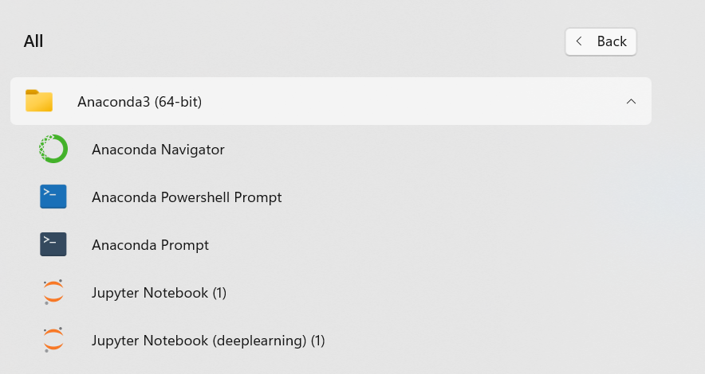
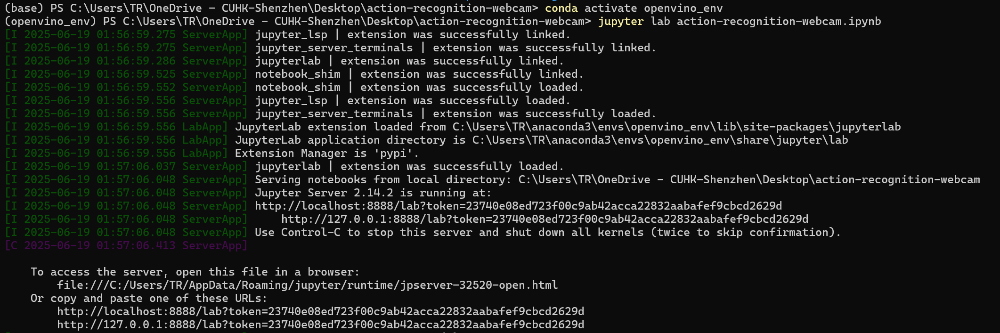

# 实时动作识别

<p align="center" width="100%">
    
</p>

## 主要内容
对动作进行实时识别，可上传本地视频，也可实时通过电脑摄像头拍摄

## 环境配置
**第1步：安装 Conda**

如果你还没有安装 Conda，请根据你的操作系统（Windows, macOS, Linux）从官网下载并安装。
* [conda下载地址](https://www.anaconda.com/download)

**第2步：打开Anaconda Powershell Prompt**

在应用中的Anaconda3下面找到哦Anaconda Powershell Prompt并打开

**第3步：创建新的conda环境并激活**
```bash
conda create -n openvino_env python=3.8
conda activate openvino_env
```
**第4步:安装依赖库**
```bash
python -m pip install --upgrade pip==21.3.*
pip install -r requirements.txt
```
**第5步：启动jupyter notebook**
```bash
jupyter lab action-recognition-webcam.ipynb
```
## jupyter notebook使用tips
**在浏览器中打开**

完成上述操作后复制最下方链接到浏览器中打开

**常用快捷键**

ctrl+enter:运行当前单元格并停留在当前单元格

shift+enter:运行当前单元格并移动到下一个单元格

## 试着找些素材来测试一下吧！
可选素材网站：[pexels](https://www.pexels.com/)